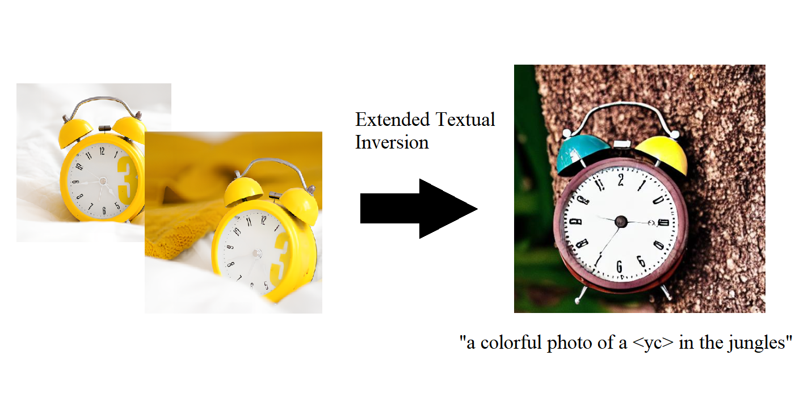

# Prompt++

<!-- #region -->
<p align="center">

</p>
<!-- #endregion -->

Unofficial Implementation of [Prompt+](https://prompt-plus.github.io/), with bit of my own additions to further explore the P+ space of the stable diffusion.

# Introduction

We typically use single text conditioning as an input. Naturally, we reuse the same conditioning for all CrossAttention layer. What if we don't? Prompt+ explores this idea, that we can use different text embedding for different cross attention layers, and it works! Prompt+ textual inversion allows you to "extend" the textual inversion process "per-layer", so although we get 16 total tokens, we can expect better results than the original textual inversion.

Ok, but the code was not released yet, so I decided to implement it myself. I also added some of my own ideas to further explore the P+ space of the stable diffusion.

# So what's my idea?

One possible suboptimality XTI brings is that the idea of having multiple uncorrelated tokens are implicitly assumed. Indeed, unless some second-order optimzier kicks in, all the extended tokens (in a sense) don't know each other at all.
This is certainly weird : we have multiple tokens, that are supposed to be correlated (infact, they have to be idential in the original space), but the optimization doesn't account that.

So here I introduce P++ (I just couldn't resist the name), where extended textual inversion occurs with common correlated text embedding. Token $t_i$ lookup embedding $e_i$ has a common embedding $e_c$ that is shared across all tokens. i.e.,

$$
t_i \rightarrow e_c | e_i
$$

Borrowing some ideas from [Encoder4Edit](https://arxiv.org/abs/2102.02766), we make this process "gradually", where $e_i$ are leant only after coarse $e_c$ is learned. Since it is a common tradition(?) to lower the learning rate when "what you have to learn" is small, we also lower the learning rate of $e_i$ as the training progresses. Note that this can be simplified with two-stage process, also even be viewed as [pivotal-tuning](https://arxiv.org/abs/2106.05744). However, I think the general idea is that the tokens should be correlated, and this is one way to achieve that. (just happens to be pivotal-tuning looking)

# Results

Initial experiments :

<!-- #region -->
<p align="center">

</p>
<!-- #endregion -->

> Naive ETI, 1500 steps

<!-- #region -->
<p align="center">

</p>
<!-- #endregion -->

> Correlated ETI, 800 steps

I literally did 1 experiments, so I don't know if this is a good idea or not. But I think it is worth further exploration. Use this repo if you want to try it out.

# Usage

### Installation

As of now, this repo requires lora-diffusion as a dependency. You can install it by

```bash
pip install git+https://github.com/cloneofsimo/lora.git
```

(I will remove this dependency in the future, maybe...)

Install this repo by

```bash
pip install git+https://github.com/cloneofsimo/ppp.git
```

### Training

Use `ppp_train` command to train: following example

```bash
export MODEL_NAME="runwayml/stable-diffusion-v1-5"
export INSTANCE_DIR="./dataset/data_yc"
export OUTPUT_DIR="./exps/yc"

ppp_train --pretrained_model_name_or_path=$MODEL_NAME  \
  --instance_data_dir=$INSTANCE_DIR \
  --output_dir=$OUTPUT_DIR \
  --placeholder_tokens="<yc>" \
  --use_template="object" \
  --do_coarse_inversion=False \
  --preserve_prefix=False \
```

### Inference

Inference is bit tricky. You need to set attentionprocessor that I made, and overwrite the pipeline of `StableDiffusionPipeline` with custom call function. Luckily, I do that all for you. If you would like to know what is going on, please check out the source code.

```python

from ppp import PPPPromptManager
from ppp import overwrite_call
from ppp import PPPAttenProc
from lora_diffusion import patch_pipe

from diffusers import StableDiffusionPipeline, EulerAncestralDiscreteScheduler
import torch

model_id = "runwayml/stable-diffusion-v1-5"

pipe = StableDiffusionPipeline.from_pretrained(model_id, torch_dtype=torch.float16).to(
    "cuda"
)

pm = PPPPromptManager(tokenizer= pipe.tokenizer, \
    text_encoder=pipe.text_encoder, \
    main_token="<yc>", preserve_prefix=False, extend_amount=1)


pipe.unet.set_attn_processor(PPPAttenProc())


patch_pipe(pipe, "./exps/yc/step_inv_1000.safetensors")

with torch.no_grad():
    ps = pm.embed_prompt("a colorful photo of a <yc> in the jungles")
torch.manual_seed(0)
overwrite_call(pipe, prompt_embeds=ps).images[0].save("test.png")
```

# References

```bibtex
@article{voynov2023p+,
  title={$ P+ $: Extended Textual Conditioning in Text-to-Image Generation},
  author={Voynov, Andrey and Chu, Qinghao and Cohen-Or, Daniel and Aberman, Kfir},
  journal={arXiv preprint arXiv:2303.09522},
  year={2023}
}
```

```bibtex
@article{roich2022pivotal,
  title={Pivotal tuning for latent-based editing of real images},
  author={Roich, Daniel and Mokady, Ron and Bermano, Amit H and Cohen-Or, Daniel},
  journal={ACM Transactions on Graphics (TOG)},
  volume={42},
  number={1},
  pages={1--13},
  year={2022},
  publisher={ACM New York, NY}
}
```

```bibtex
@article{tov2021designing,
  title={Designing an encoder for stylegan image manipulation},
  author={Tov, Omer and Alaluf, Yuval and Nitzan, Yotam and Patashnik, Or and Cohen-Or, Daniel},
  journal={ACM Transactions on Graphics (TOG)},
  volume={40},
  number={4},
  pages={1--14},
  year={2021},
  publisher={ACM New York, NY, USA}
}
```
